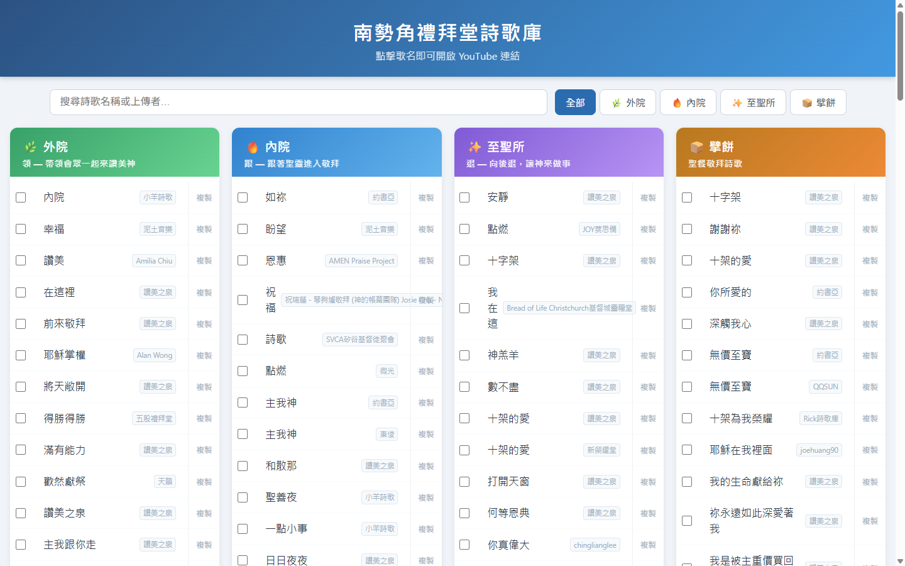
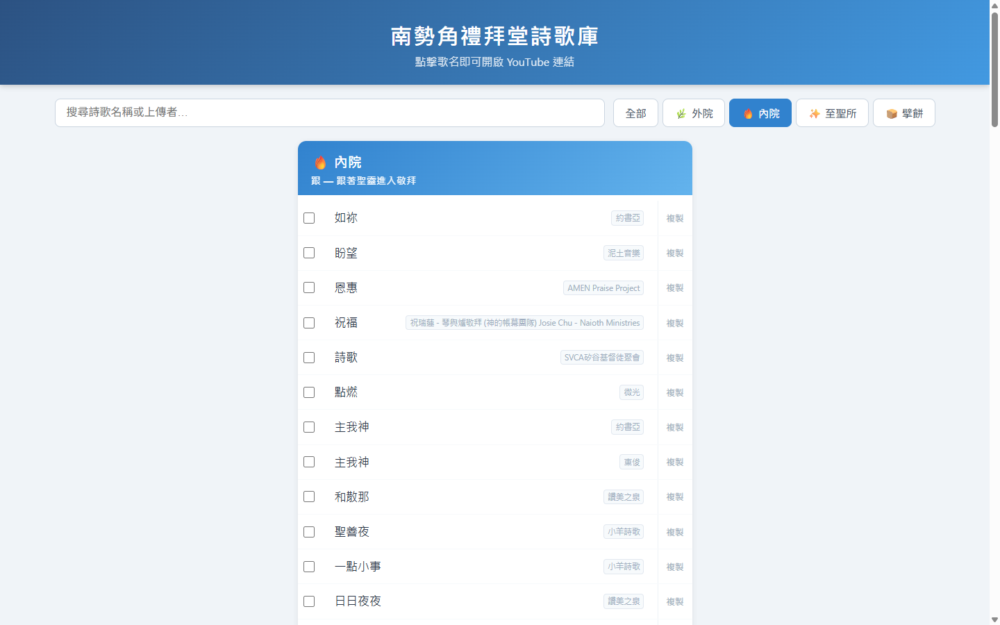

# 南勢角禮拜堂詩歌庫

[](LICENSE) [](https://workers.cloudflare.com/) [](https://developers.line.biz/) [](https://church-songs.pages.dev)

教會領會詩歌分類網站 + LINE Bot 自動新增歌曲。

**線上網址**：https://church-songs.pages.dev

---


## 📸 截圖

<table>
  <tr>
    <td align="center"><br/><sub>詩歌庫主頁</sub></td>
    <td align="center"><br/><sub>分類篩選</sub></td>
  </tr>
  <tr>
    <td colspan="2" align="center"><br/><sub>LINE Bot 自動分類</sub></td>
  </tr>
</table>

> 截圖檔案放在 [`docs/screenshots/`](docs/screenshots/)

---

## 這個專案在做什麼？

```
你在 LINE 群組貼一個 YouTube 連結
        ↓
LINE Bot 自動抓取歌名、判斷分類（外院／內院／至聖所／擘餅）
        ↓
歌曲出現在網站上，領會同工可以搜尋、複製連結
```

網站功能包含：搜尋歌名、依分類篩選、複製短連結、手機直接跳 YouTube App。

---

## 需要註冊哪些帳號

| 服務 | 用途 | 費用 |
|---|---|---|
| [Cloudflare](https://dash.cloudflare.com/sign-up) | 部署網站＋儲存歌曲資料 | 免費 |
| [LINE Developers](https://developers.line.biz/) | 建立 LINE Bot（Messaging API） | 免費 |

> **不需要** AWS、GCP、主機費或任何付費服務。

---

## 第一次設定（從零開始）

### 1. 安裝工具

```bash
# 需要 Node.js 18+，確認版本
node -v

# 安裝 Wrangler（Cloudflare 部署工具）
npm install -g wrangler

# 登入 Cloudflare
wrangler login
```

### 2. 建立 Cloudflare KV（儲存歌曲的資料庫）

```bash
wrangler kv namespace create CHURCH_SONGS
```

執行後會輸出類似：
```
id = "xxxxxxxxxxxxxxxxxxxxxxxxxxxx"
```

把這個 `id` 填入 `wrangler.toml` 的對應位置：
```toml
[[kv_namespaces]]
binding = "SONGS_KV"
id = "你的KV_ID填這裡"
```

### 3. 建立 LINE Bot

1. 前往 [LINE Developers Console](https://developers.line.biz/console/)
2. 建立一個 **Provider**（例如：南勢角禮拜堂）
3. 建立一個 **Messaging API Channel**
4. 在 Channel 設定頁面找到：
   - **Channel Secret** → 後面會用到
   - **Channel Access Token**（長版，需要點 Issue）→ 後面會用到

### 4. 設定 Wrangler 環境變數（機密資訊）

```bash
# LINE Bot 的 Channel Secret
wrangler secret put LINE_SECRET

# LINE Bot 的 Channel Access Token
wrangler secret put LINE_TOKEN
```

執行後會提示你貼上對應的值。

### 5. 部署 Worker

```bash
wrangler deploy worker.js --name=church-songs-bot --compatibility-date=2024-01-01
```

部署完成後會顯示：
```
https://church-songs-bot.你的帳號.workers.dev
```

### 6. 設定 LINE Bot Webhook

回到 LINE Developers Console → Messaging API：

- **Webhook URL** 填入：`https://church-songs-bot.你的帳號.workers.dev/webhook`
- 打開 **Use webhook** 開關
- 點 **Verify** 確認連線成功（應顯示 Success）
- 關閉 **Auto-reply messages**（不然 Bot 會重複回覆）

### 7. 設定網址（讓 URL 好看，非必要）

如果想讓網址是 `church-songs.pages.dev` 而不是那一長串：

1. 在 Cloudflare 建立 **Pages 專案**（名稱：`church-songs`）
2. 在專案目錄建立 `functions/_middleware.js`，內容如下：

```javascript
export async function onRequest(context) {
  const url = new URL(context.request.url);
  const workerUrl = 'https://church-songs-bot.你的帳號.workers.dev' + url.pathname + url.search;
  const resp = await fetch(workerUrl, {
    method: context.request.method,
    headers: context.request.headers,
    body: context.request.method !== 'GET' && context.request.method !== 'HEAD'
      ? context.request.body : undefined,
  });
  return new Response(resp.body, { status: resp.status, headers: resp.headers });
}
```

3. 部署 Pages：
```bash
wrangler pages deploy . --project-name=church-songs --branch=main
```

---

## 日常使用：如何新增歌曲

直接在 LINE 群組（或私訊 Bot）貼 YouTube 連結：

```
https://youtu.be/abc123
```

Bot 會自動回覆：
```
✅ 已新增《信靠主》
📺 原始標題：信靠主 Trust in the Lord｜讚美之泉
分類：✨ 至聖所　上傳者：讚美之泉
名字辨識錯？更名 abc123 正確歌名
分類不對？更改分類 abc123 外院／內院／至聖所／擘餅
要刪除？刪除 abc123
```

### 管理指令

```
更名 abc123 新的歌名
更改分類 abc123 外院
刪除 abc123
```

---

## 更新程式碼後如何重新部署

```bash
# 修改 worker.js 後執行
wrangler deploy worker.js --name=church-songs-bot --compatibility-date=2024-01-01
```

---

## 專案架構

```
church-songs/
├── worker.js        # 主程式（網站 + LINE Bot）
├── wrangler.toml    # Cloudflare 部署設定
├── CLAUDE.md        # 給 AI 助理看的專案詳細說明
└── README.md        # 這個檔案
```

### 技術架構

```
LINE App
  │  傳送 YouTube 連結
  ▼
Cloudflare Worker  (/webhook)
  │  驗證簽名 → 抓 YouTube 資訊 → AI 分類 → 存 KV
  ▼
Cloudflare KV      (歌曲資料庫)
  │
  ▼
Cloudflare Worker  (GET /)
  │  從 KV 讀資料 → 產生 HTML
  ▼
使用者瀏覽器        (church-songs.pages.dev)
```

---

## 常見問題

**Q: Bot 沒有回覆？**
→ 確認 LINE Developers Console 的 Webhook URL 設定正確，且 Verify 顯示 Success。

**Q: 歌名辨識錯誤？**
→ 用 `更名 影片ID 正確歌名` 指令手動修正。

**Q: 想讓 Bot 加入群組？**
→ 在 LINE OA Manager → 功能切換 → 加入群組或多人聊天室 → 設為「接受邀請」。

**Q: 網站更新很慢？**
→ Cloudflare 有 CDN 快取，強制重新整理（Ctrl+Shift+R）或等幾分鐘。
